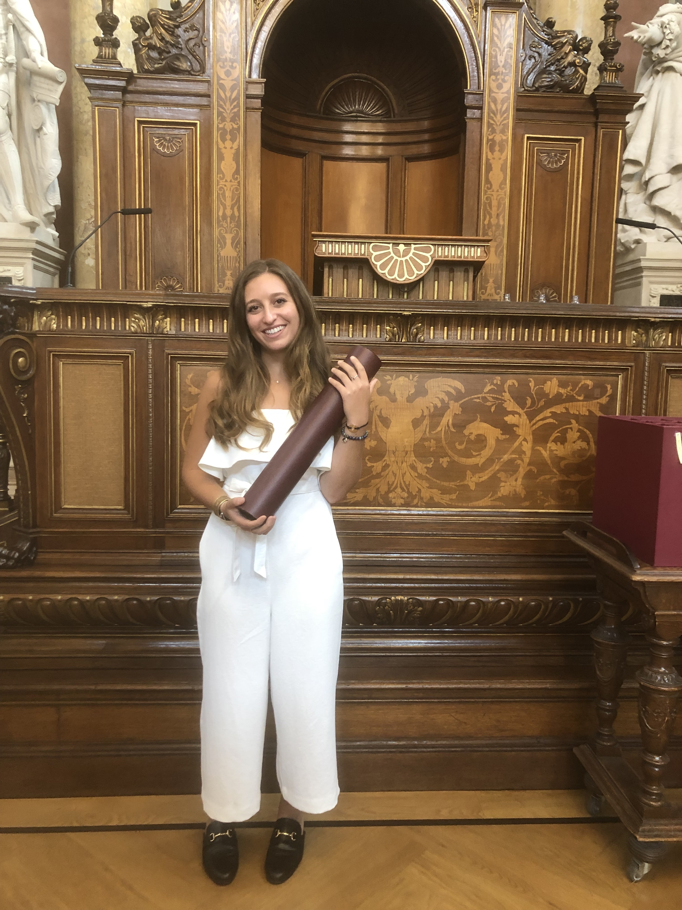

```{r setup, include=FALSE}
knitr::opts_chunk$set(echo = FALSE)
```

### Background

Dani Sclafani is originally from Mendham, New Jersey where she grew up with her two siblings Sal and Katie. 

Dani is a member Bucknell University's graduating Class of 2019, where she obtained a Bachelor of Arts in International Relations. The first year after graduating from Bucknell Dani lived and worked in New York City at Horizon-Next, a full service media agency, as an Assistant Brand Strategist. 

In September 2020, Dani moved to Santa Barbara, California to begin her Master's degree at the Bren School for Environmental Science & Management where she will be specializing in Energy and Climate, and Pollution, Prevention, & Remediation. Upon graduating from Bren, Dani hopes to begin a career in energy consulting or corporate environmenal management.

### Interests
Before the outbreak of COVID-19, Dani enjoyed traveling with her sister Katie and friends. Their most recent roadtrip was from Lake Como, Italy to Nice, France before returning to Vienna, Austria for Katie's graduation from the University of Vienna's Master of Human Rights program. 


```{r, echo = FALSE, out.width= "50%", fig.align='center', fig.cap= "Katie recieving her Masters in Human Rights from the Univseristy of Vienna in October 2019. \n #Proud sister moment!"}

 
``` 


Previous to this trip, Dani lived in Prague, Czech Republic for five months to study at Charles University and traveled to neighboring countries during her stay there. 
In 2017, Dani traveled to Cape Town, South Africa with a group of Bucknell students to study the Economics and Politics of South Africa in the post-Apartheid era. Dani also interned at Cape Town Partnership, a social inclusion non-profit, while in South Africa. Dani hopes to continue to explore the world once it is safe to travel again.

Dani's favorite hobby is horseback riding, and she has been riding since she was six years old. While an undergraduate, Dani was a member of Bucknell's equestrian team for four years and continues to ride whenever she can.

Dani also enjoys hiking, bird watching, gardening, cooking, and hanging out with her new dog Bennie.


### Data Science Experience

As an Assistant Brand Strategist at Horizon-Next Dani used excel to evaluate client data and create data visualizations for weekly client presentations. Dani learned R and GitHub while at Bren, and hopes to continue to improve on these skills by participating in Tidy Tuesdays and eventually branch out into additional coding platforms.


